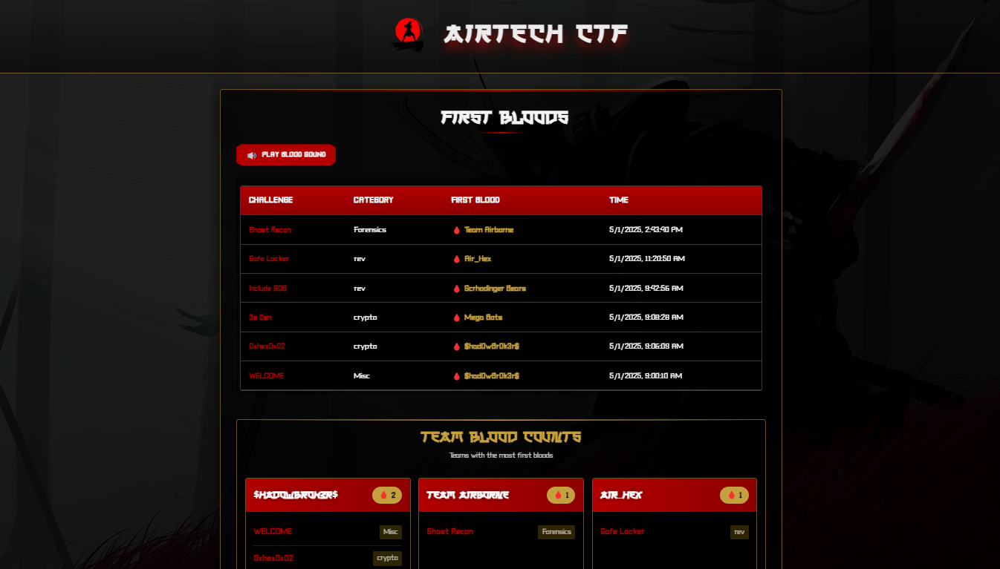

# CTF First Bloods

A beautiful, samurai-themed first bloods display for CTFd instances.



## Setup

### Prerequisites

- Node.js (v14 or newer)
- npm or yarn

### Installation

1. Clone this repository:
   ```bash
   https://github.com/kumailzaidi23/blood-announcer
   cd blood-announcer
   ```

2. Install dependencies:
   ```bash
   npm install
   ```

3. Configure the CTFd URL and authentication:
   - Update the following constants with your CTFd instance details:
```js
CTFD_TOKEN="ctfd_REDACTED"
PORT=3000
CTFD_URL="https://example.com"
```

4. Start the server:
   ```bash
   npm start
   ```

5. Access the first bloods display:
   - Open your browser and navigate to `http://localhost:3000`


### Colors and Themes

You can customize the look and feel by editing the CSS variables in `static/css/styles.css`:

```css
:root {
    --primary-color: #c41e3a; /* Red - traditional Japanese color */
    --secondary-color: #000000; /* Black */
    --accent-color: #e1b80d; /* Gold */
    --blood-color: rgba(196, 30, 58, 0.7);
    /* other variables... */
}
```

### Background Image

To change the background image, edit the following CSS in `static/css/styles.css`:

```css
.background-container {
    /* ... */
    background-image: url('path/to/your/image.jpg');
    /* ... */
}
```

*First blood is the sweetest victory.* ⚔️ 🩸 